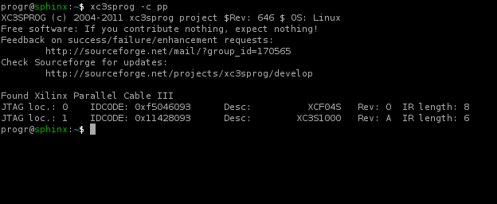
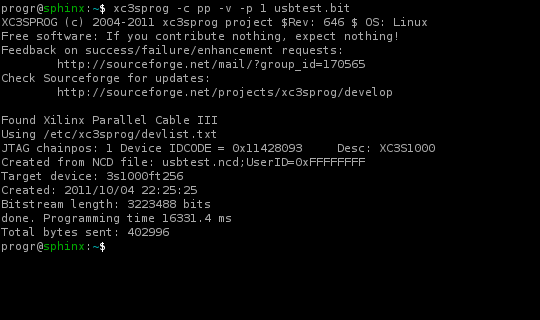

# xc3sprog: инструментарий JTAG

Источник https://microsin.net/programming/avr/xc3sprog-jtag-tools.html
 
xc3sprog это набор утилит для программирования микросхем Xilinx FPGA, CPLD и EEPROM через Xilinx Parallel Cable и другие адаптеры JTAG. xc3sprog запускается как приложение с интерфейсом командной строки на операционных системах Linux и Windows.

Основные возможности включают:

• Чтение файла *.BIT, который генерирует инструментарий разработки Xilinx, и программирование его в FPGA.
• Чтение файла JEDEC и программирование его в CPLD.
• Программирование файла *.BIT в конфигурационную память PROM, находящуюся на плате системы.
• Программирование двоичного образа в память flash с интерфейсом SPI, находящуюся на плате системы.
• Чтение содержимого чипа PROM обратно в файл.
• Программирование микроконтроллеров AVR.

Функционал xc3sprog подобен функционалу утилиты Xilinx IMPACT. Есть также сходство с другими бесплатными инструментами JTAG, такими как UrJTAG [6]. Однако xc3sprog имеет некоторое количество достоинств, собранных вместе:

• xc3sprog является свободным программным обеспечением.
• xc3sprog работает как утилита командной строки.
• xc3sprog работает под Linux без необходимости установки двоичных драйверов кабеля (cable-drivers). Однако некоторые типы кабелей JTAG требуют загрузки firmware.
• xc3sprog использует опциональный файл конфигурации для распознавания новых устройств JTAG.
• xc3sprog содержит алгоритмы программирования для поддерживаемых устройств, позволяя прямое использование двоичных файлов (.BIT / JEDEC), полученных от средств их разработки (в отличие от использования промежуточных файлов SVF/STAPLE).

Первая версия xc3sprog была написана Andrew Rogers. Затем код был улучшен и расширен Uwe Bonnes и другими разработчиками.

Как следует из имени утилиты, xc3sprog была изначально разработана для программирования микросхем Xilinx Spartan-3 FPGA. Однако затем утилита была усовершенствована для поддержки некоторых других типов устройств, включая микросхемы Xilinx FPGA, CPLD, XCF flash PROM, Atmel AVR и чипы SPI flash.

Документация. Прочитайте руководство [2] (или см. раздел "Быстрый старт" ниже) чтобы быстро ознакомиться с установкой и использованием xc3sprog, или обратитесь к встроенной справке или странице руководства [3] (или см. врезку "Руководство пользователя" ниже) для получения подробных инструкций по использованию утилиты. Просмотрите список поддерживаемой аппаратуры [4] (также дан во врезке "Оборудование, поддерживаемое xc3sprog"), чтобы определить, поддерживается ли Ваша целевая плата и кабель JTAG.

Лицензия. xc3sprog лицензируется под GNU General Public License (GPL version 2 или более свежей версии). Подробнее см. файлы README и COPYING, находящиеся в репозитории исходного кода xc3sprog.

Информационная рассылка. Пользователи могут использовать список рассылки xc3sprog-users (http://sourceforge.net/mail/?group_id=170565) для общего обсуждения вопросов, касающихся xc3sprog. Приветствуются вопросы, замечания и сообщения об ошибках.

### [Быстрый старт]

Установка под Linux. Чтобы получить xc3sprog, сначала загрузите исходный код с SourceForge:

```shell
svn co https://xc3sprog.svn.sourceforge.net/svnroot/xc3sprog/trunk xc3sprog
```
Затем скомпилируйте установите программу:

```shell
cd xc3sprog
cmake .
make
make install
```
Установка под Windows. Собственно установки никакой нет. Скачайте архив build-win32_rev780_stripped.tar.gz (rev780 обозначает версию утилиты, и эта часть имени может быть другой), распакуйте его содержимое в любую папку на диске, настройте пути запуска в переменной окружения %PATH%.

Как использовать. Подключите кабель JTAG к компьютеру, и подключите этот кабель к своей рабочей плате (которую собираетесь программировать). Запустите утилиту xc3sprog, и проверьте, что она детектирует цепочку JTAG платы. Тип кабеля JTAG должен быть указан в опции командной строки. Просмотрите таблицу поддерживаемого оборудования [4], чтобы найти имя (label, метку опции) для Вашего типа кабеля. В этом примере используется кабель JTAG, подключенный к параллельному порту:

```shell
xc3sprog -c pp
```


Следующий пример показывает, как прошивать FPGA. Плата в этом примере содержит XCF PROM в позиции 0 и Xilinx FPGA в позиции 1.

Мы указываем позицию 1 в цепочке (chain position 1) для прямого программирования FPGA. Новая программа вступит в силу немедленно, но это будет работать только до того момента, пока присутствует питание на плате (после выключения питания и повторного включения конфигурация будет потеряна). Чтобы перешить плату на постоянную работу, требуется запрограммировать flash PROM, для этого выбирается позиция 0.
```shell
xc3sprog -c pp -v -p 1 filename.bit
```


xc3sprog поддерживает множество настроек для других плат и других операций по программированию. Подробнее см. руководство [3] (или врезку "Руководство пользователя"), где имеется описание команд, опций и другие примеры использования.


## Программируемые устройства:

• Xilinx XC95X series
• Xilinx CoolRunner-II
• Xilinx Spartan-2
• Xilinx Spartan-3
• Xilinx Spartan-6
• Xilinx Virtex-2 (не тестировалось)
• Xilinx Virtex-5
• Xilinx 7 Series (Virtex-7, Kintex-7, Artix-7; tested on XC7VX690T, XC7A200T)
• Xilinx Zynq 7000 (only logic, not ARM)
• Xilinx Platform Flash XCFnnS
• Xilinx Platform Flash XCFnnP (ограниченная функциональность)
• Atmel AVR: ATmega, Xmega
• SPI flash: AT45, AMIC, AMIC-QUAD, M25P, N25Q, S33, W25

## Поддерживаемые кабели JTAG:

label	|Интерфейс|	Описание
----------|----------|----------
pp	   |parallel port	|Xilinx Parallel Cable III (DLC5), или Altera ByteBlaster
ftdi   |USB|Стандартный кабель JTAG на основе чипа FTDI (FT2232C, FT232H или совместимый)
bbv2   |USB|	Bus Blaster v2 (DangerousPrototypes)
bbv2_2 |USB|Bus Blaster v2, internal JTAG port
amontec|USB|	Amontec JTAGkey
olimex |USB|Адаптер Olimex USB-JTAG
jtaghs1|USB|	Кабель Digilent JTAG-HS1
jtaghs2|USB|	Кабель Digilent JTAG-HS2
ikda	  |USB|	 
llbbc	 |USB|	 
llif	  |USB|	 
llbus	 |USB|	 
ftdijtag	|USB|	 
ft2232test	|USB|	 
l_motctl	|USB|	 
l_motctl_avr	 	 
knob2usb	|USB|	 
qm07_pu	|USB|	 
xpc	|USB|	Xilinx Platform Cable USB II (DLC10), или программатор, встроенный в плату разработчика (например, Spartan 3E starter kit)
llbbc08	|USB|	 
qdu16	|USB|	 

## Руководство пользователя


### [СИНОПСИС]
```shell
xc3sprog -c cable [options] file1spec [file2spec ...]
xc3sprog -c cable [options] -j
```
### [ОПИСАНИЕ]

xc3sprog это утилита командной строки для программирования микросхем FPGAs, микроконтроллеров и микросхем энергонезависимой памяти (PROM, SPI FLASH и т. п.) через JTAG. 

Обычно утилита xc3sprog читает файл .BIT, который генерирует инструментарий разработки прошивки FPGA, и затем программирует его в чип PROM, находящийся на плате FPGA, откуда будет производиться загрузка прошивки в FPGA при включении питания. Как вариант, прошивка может быть записана напрямую в конфигурационное RAM FPGA, но при выключении питания эта конфигурация будет потеряна. Другие разные варианты использования см. в секции ПРИМЕРЫ.

Как показывает имя утилиты, xc3sprog изначально была разработана для Xilinx Spartan-3 FPGA. Однако список поддерживаемых микросхем был впоследствии расширен для Xilinx FPGA, CPLD, микросхем XCF flash PROM, микроконтроллеров Atmel AVR и чипов SPI flash. xc3sprog поддерживает несколько вариантов кабелей JTAG, включая кабели параллельного порта и программаторы USB.

### [ОПЦИИ]
```shell
-c cable
```
Задает тип кабеля JTAG. Тип указывается меткой (см. врезку "Оборудование, поддерживаемое xc3sprog"). Наиболее часто используется pp (кабель параллельного порта LPT), xpc (Xilinx USB programmer) и ftdi (программатор на основе чипов USB компании FTDI).
```shell
-j
```
Опрашивает цепочку JTAG и выводит список подключенных устройств. Это действие выполняется по умолчанию, если ничего другое не задано. 
```shell
-p val[,val,...]
```
Задает использовать устройство на указанной позиции в цепочки JTAG. По умолчанию (если val не указано) подразумевается позиция 0, соответствующая устройству, напрямую подключенному к выводу TDO кабеля JTAG. Используйте эту опцию для выбора конкретного устройства в цепочке JTAG, когда к этой цепочке подключено несколько устройств.

Если указано несколько позиций, файл данных будет поделен на части. Эти части будут запрограммированы по порядку, сначала в первое устройство, затем в следующее, и так далее. Это полезно для плат, на которых находятся несколько чипов XCF, конфигурирующий одну микросхему FPGA.
```shell
-Tn
```
Тестирует цепочку JTAG n раз. Когда идет работа в режиме ISF, тестируется соединение SPI. Если n не указано, то по умолчанию тест будет проведен 10000 раз. Если n = 0, то тестирование будет происходить бесконечно.
```shell
-J freq
```
Задает частоту тактов JTAG (freq указывается в Гц). Если частота не указана, или если freq = 0, то по умолчанию кабель будет работать на своей максимальной поддерживаемой частоте. В настоящий момент эта опция поддерживается только для кабелей на основе чипов FTDI.
```shell
-e
```
Стирает всю память устройства.
```shell
-I[file]
```
Работа в режиме ISF для программирования внутренней последовательной памяти flash (аббревиатура ISF расшифровывается как internal  serial flash). Память flash подключена к главной целевой микросхеме JTAG, но эта память не доступна напрямую через цепочку JTAG. Главная целевая микросхема JTAG используется как прокси (промежуточный узел доступа) для перенаправления транзакций SPI к памяти flash. Если указан файл, то запускается программирование указанного битового файла (bitfile) в главную цель JTAG (обычно это микросхема FPGA).
```shell
-R
```
Посылает команду реконфигурирования в целевое устройство (XCV, XCF, XCFP для переконфигурирования подключенного устройства FPGA или напрямую XC3S, XC6S, XC2V).
```shell
-m mapdir
```
Задает искать map-файлы XC2C в указанной директории. Map-файлы требуются для обработки файлов JEDEC при программировании CPLD. Если опция не указана, то по умолчанию используется каталог из переменной окружения $XC_MAPDIR.
```shell
-d /dev/parportN
```
Задает параллельный порт, через который подключен кабель. Если не указано, то по умолчанию используется переменная окружения $XCPORT или /dev/parport0. Опция используется только типа кабеля pp.
```shell
-s serialnum
```
Задает использовать устройство USB с указанной строкой серийного номера. Эта опция нужна, когда к хосту одновременно подключено несколько адаптеров одинакового типа.
```shell
-L
```
Задает использовать libFTD2XX вместо libftdi для получения доступа к кабелям на основе чипа FTDI.
```shell
-D
```
Выполняет дамп базы данных устройств (device database) и базы данных кабелей (cable database) в файлы devlist.txt и cablelist.txt, и записывает эти файлы в текущую директорию. Если файл уже существует, то xc3sprog пытается генерировать уникальное имя файла на основе добавления к имени увеличивающегося числа.
```shell
-X opt[,opt...]
```
Устанавливает режим конфигурации для устройств XCFnnP PROM. Конфигурирование из XCFnnP PROM может быть реализовано в нескольких режимах, в зависимости от разводки между XCFnnP и FPGA. По умолчанию xc3sprog подготавливает устройства XCFnnP для подчиненного последовательного обмена, slave serial mode (FPGA работает как главное устройство, master serial mode).

Чтобы поменять эти установки по умолчанию, укажите список опций с разделителем в виде запятой. Допустимы следующие опции:

   master XCFnnP выступает как master (FPGA как slave)
   slave XCFnnP выступает как slave (FPGA как master, это установка по умолчанию)
   parallel параллельная шина данных конфигурации
   serial последовательная линия данных конфигурации (по умолчанию)
   extclk использовать внешние такты в режиме master
   intclk использовать внутренние такты в режиме master
   fastclk использовать быстрые внутренние такты
   slowclk использовать медленные внутренние такты
```shell
-v
```
Разрешить подробный вывод.
```shell
-h
```
Вывести текст подсказки.

### [СПЕЦИФИКАЦИЯ ВЫПОЛНЯЕМЫХ ДЕЙСТВИЙ]

Может быть задано одно или большее количество действий. Каждое действие состоит из имени файла, за которым опционально идут атрибуты в форме filename:action:offset:style:length

**filename**

Файл, который записывается в устройство, или файл для данных, которые были прочитаны из устройства.

**action**

Одна буква, которая показывает, что нужно выполнить - запись (write), чтение (read), или проверку (verify) устройства. Если не указано, то по умолчанию подразумевается действие 'w'.

   w стереть устройство, затем записать данные из файла, и затем проверить.
   W записать с автоматическим стиранием по одному сектору, и проверить.
   v проверить содержимое устройства с содержимым файла.
   r чтение из устройства и запись в файл (без перезаписи существующего файла).
   R чтение из устройства и запись в файл (если файл существует, то он будет перезаписан).

**offset**

Байтовое смещение внутри устройства, откуда должно начаться программирование/чтение. Поддерживается только для устройств SPI, XCFnnS и XMEGA.

**style**

Задает формат файла.

   BIT формат Xilinx .BIT. Используется по умолчанию для устройств FPGA, XCF и SPI.
   BIN сырой двоичный файл.
   BPI сырой двоичный файл без реверса потока бит (Raw binary file not bit reversed).
   MCS файл Xilinx .MCS.
   IHEX формат Intel HEX. Также используется Xilinx PROMGEN, когда записываются файлы MCS. По умолчанию применяется для микроконтроллеров Atmel XMEGA.
   HEXRAW сырые данные в виде последовательности шестнадцатеричных цифр.
   JEDEC файл по умолчанию для устройств CPLD. 

**length**

Количество байт для программирования/чтения. Поддерживается для устройств SPI, XCFnnS и XMEGA.

### [БАЗА ДАННЫХ ПОДДЕРЖИВАЕМЫХ УСТРОЙСТВ (DEVICE DATABASE)]

Содержит список поддерживаемых устройств, программируемых/считываемых через JTAG. Когда утилита xc3sprog запускается, она сканирует цепочку JTAG, чтобы распознать все подключенные к ней устройства. База данных устройств используется для привязки 32-битных кодов ID устройств в понятным для человека именам, чтобы иметь базовое представление о том, как работать с программируемым устройством, или как минимум как пропустить его.

База данных устройств по умолчанию компилируется из тела исполняемого файла утилиты xc3sprog. При выполнении делается попытка загрузить эту базу данных из файла. Если определена переменная окружения $XCDB, то она задает имя файла базы данных устройств, иначе будет прочитан файл devlist.txt, находящийся в текущей директории. Если файл базы данных вообще не найден, то будет использоваться внутренняя база, которая задается в момент компиляции утилиты (находится в теле исполняемого файла).

Если устройство пока не известно, то встроенный список может быть сброшен в файл (с помощью опции -D). После этого редактированием этого файла может быть добавлена информация о неизвестном устройстве, и при следующем запуске xc3sprog будет считываться и использоваться этот новый список базы данных устройств.

### [БАЗА ДАННЫХ ПОДДЕРЖИВАЕМЫХ КАБЕЛЕЙ JTAG (CABLE DATABASE)]

Содержит список адаптеров JTAG (кабелей), с которыми может работать xc3sprog. Каждый тип кабеля идентифицируется коротким мнемоническим именем (label, метка), таким как pp, ftdijtag, xpc и т. д. База данных привязывает label к параметрам, используемым для доступа к аппаратуре кабеля.

База данных кабелей по умолчанию компилируется в тело исполняемого файла xc3sprog. Также при запуске xc3sprog делается попытка прочитать эту базу из внешнего файла. Если определена переменная окружения $CABLEDB, то она задает имя файла базы данных кабелей, иначе будет прочитан файл cablelist.txt, находящийся в текущей директории. Если файл базы данных вообще не найден, то будет использоваться внутренняя база, которая задается в момент компиляции утилиты (находится в теле исполняемого файла).

Если подтип кабеля (например, с другим сочетанием идентификаторов VID/PID) пока не известен, то может быть сброшен файл встроенный список кабелей (опцией -D), информация о новом кабеле может быть добавлена редактированием файла, после чего этот новый файл будет считываться и использоваться при запусках утилиты xc3sprog.

База данных кабелей это простой текстовый файл, где каждая строка содержит описание одного кабеля. Строка состоит из псевдонима для кабеля, который используется вместе с опцией -c, базового типа кабеля, максимально допустимой частоты тактов JTAG и необязательной строки опций.

Для устройств FTDI строка опций содержит идентификатор вендора USB (USB vendor ID, VID), идентификатор продукта USB (USB product ID, PID), строку описания устройства USB, канал FTDI для интерфейса JTAG, и возможно дополнительные команды для установки других выводов помимо выводов JTAG. Например, могут использоваться сигналы для подключения некоторых буферов. Если устройство JTAG использует значения VID/PID по умолчанию для чипов FTDI, то стока описания устройства USB (USB device description string) важна для того, чтобы отделить Ваше устройство JTAG от других случайно подключенных устройств FTDI, которые имеют такие же идентификаторы VID/PID.

### [ПРИМЕРЫ]
```shell
xc3sprog -c pp -j
```
Покажет список устройств JTAG, подключенных к кабелю JTAG параллельного порта.
```shell
xc3sprog -c ftdijtag -v -p 0 design.bit
```
Программирует указанный bitfile в первое устройство (position 0) цепочки JTAG. Используется кабель USB JTAG на основе чипа FTDI. Будет отображена подробная информация о выполнении процесса программирования.
```shell
xc3sprog -c ftidjtag -T
```
Проверка целостности (работоспособности) цепочки JTAG.
```shell
xc3sprog -c xpc -p 1 dump.bit:r
```
Читает содержимое устройства JTAG в позиции 1 цепочки JTAG, и записывает прочитанные данные в файл формата Xilinx .BIT. Используется кабель Xilinx USB programmer.
```shell
xc3sprog -c cable -Ibscan_spi/xc3s50an.bit design.bit
```
Загрузит файл xc3s50an.bit в микросхему FPGA, находящуюся в позиции 0 цепочки JTAG. Затем программируется файл design.bit в память ISF микросхемы FPGA.
```shell
xc3sprog -c cable -I image.bit:w:0x10000
```
Программируется файл образа в память SPI, подключенную к FPGA, начиная с байтового смещения 0x10000. Соответствующий файл bscan_spi должен быть уже загружен в FPGA, чтобы FPGA работала мостом между кабелем JTAG и шиной SPI. 

### [РАБОЧЕЕ ОКРУЖЕНИЕ (ENVIRONMENT)]

Здесь приведено описание переменных окружения, используемых утилитой xc3sprog.

**XCDB** имя файла, который используется как база данных программируемых устройств. По умолчанию это файл devlist.txt, если он находится в текущей директории, и переменная окружения XCDB не указана (либо не найден файл, указанный этой переменной).

**CABLEDB** имя файла, который используется как база данных адаптеров (кабелей) JTAG. По умолчанию это файл cablelist.txt, если он находится в текущей директории, и переменная окружения CABLEDB не указана (либо не найден файл, указанный этой переменной).

**XCPORT** задает устройство параллельного порта, которое используется для кабеля JTAG типа pp. По умолчанию будет использовано устройство /dev/parport0. Эта установка может быть изменена опцией командной строки -d.

**XC_MAPDIR** директория по умолчанию для поиска map-файлов XC2C. Эта установка может быть изменена опцией командной строки -m.

**JTAG_DEBUG** если переменная указана, то лог операций JTAG будет записан в файл с этим именем.

**FTDI_DEBUG** если задано, то лог обмена с устройством FTDI записывается в файл с этим именем. Используется только для кабелей на основе чипов FTDI.

**XPC_DEBUG** если переменная задана, то лог обмена с программатором XPC записывается в файл с этим именем. Применяется только для кабелей, основанных на XPC.

**SPI_DEBUG** если переменная указана, то лог операций SPI записывается в файл с этим именем. Используется в режиме ISF.

**PDI_DEBUG** если переменная указана, то лог операций PDI записывается в файл с этим именем. Используется только при программировании микроконтроллеров Atmel XMega.

### [ФАЙЛЫ]

**devlist.txt** база данных устройств, содержащая список известных целевых устройств JTAG. По умолчанию этот файл ищется в текущей директории, или из места на диске, на которое указывает переменная окружения XCDB. Если указанный файл не найден, то используется внутренняя версия базы данных, которая задается в момент компилирования утилиты xc3sprog.

**cablelist.txt** база данных адаптеров (кабелей) JTAG, содержащая список известных типов кабелей JTAG. По умолчанию этот файл ищется в текущей директории, или из места на диске, на которое указывает переменная окружения CABLEDB. Если указанный файл не найден, то используется внутренняя версия базы данных, которая задается в момент компилирования утилиты xc3sprog.

**LITEHM2**: xc3sprog -c ft232h -v -p 0 rv901t_example_modded.bit
