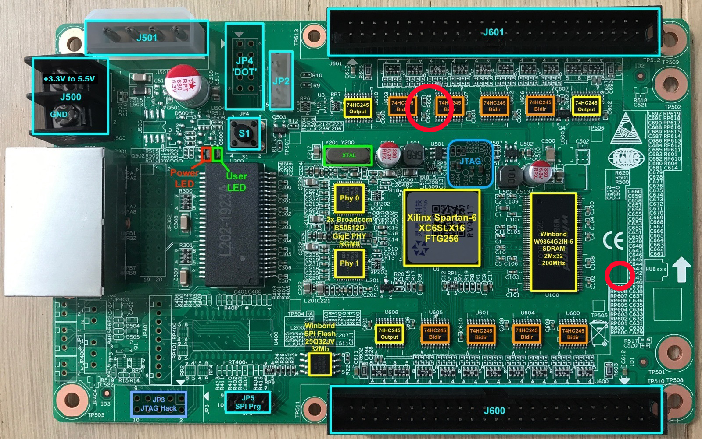
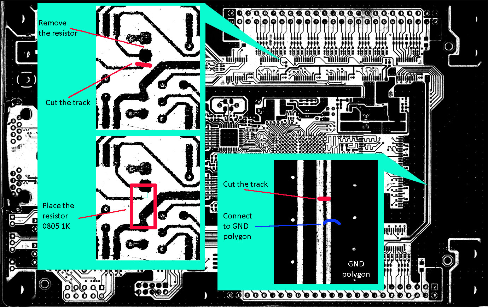

RV901T Modification
--------------------

The rv901t has 11 bidirectional drivers with 8 ports each, of which 3 are
hardwired to output.
The other 8 can be switched to input or output, but only all at once. So you
basically have two options here:
1. Use 2 boards, one for output, one for input,
2. Modify a board to get a mixture of both.

I have modified my board so that the upper row is always configured as output,
while the bottom row is switched to input via software. The modification is
quite simple.

There are two options. 
The first one consists of:
1. removing of R608 resistor (upper part of the board)
2. cutting the track which goes to FPGA F13 pin,
3. solder the resistor (0805 1K) that will pull up to 5V upper segment of the track
4. cutting the track  (bottom right corner)
5. connecting its bottom part to GND polygon

The second one consist of:
1. cutting the track (bottom right corner)
2. connecting its bottom part to GND polygon
3. in FPGA "connect" F13 pin to Vcc

All of these options work.
